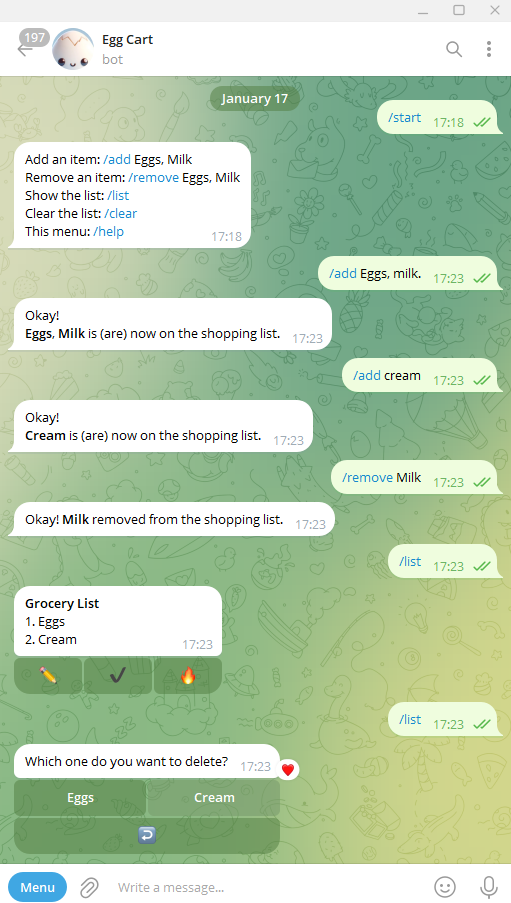

# eggcart
## Grocery List Telegram Bot


## Description
EggCart is a Telegram Bot designed to manage your grocery list efficiently. Built with Node.js, SQLite, and Telegraf, it offers a simple and interactive way to add, remove, and manage items on your grocery list through Telegram.

## Features
- Add items to your grocery list with a simple Telegram command.
- Remove items from the list as you purchase them.
- View the entire list at any time.
- Clear the list with one command.

## Screenshot



## Installation
To get EggCart up and running, follow these steps:

1. Clone the repository

    ```bash
    git clone https://github.com/ljgonzalez1/eggcart.git eggcart
    ```

2. Install the dependencies:
    ```bash
    cd eggcart
    yarn install
    ```
   
3. Setup your postgres environment

4. Create a `.env` file in the root directory and add your Telegram Bot API key and other required environment variables, like the one on `template.env`
    ```dotenv
    TELEGRAM_TOKEN=1234567890:aA0bB1cC2dD3eE4fF5gG6iI7hH8jJ9kK0lL
    POSTGRES_HOST=localhost
    POSTGRES_PORT=5432
    POSTGRES_USERNAME=admin
    POSTGRES_PASSWORD=password
    POSTGRES_DB_NAME=database
    ```
 
5. Start the bot:
    ```bash
    yarn start
    ```

## Usage
Once the bot is running, you can interact with it on Telegram using the following commands:
- `/add item1, item2, ...` - Add items to your grocery list.
- `/remove item1, item2, ...` - Remove items from your grocery list.
- `/list` - Display the current grocery list.
- `/clear` - Clear the grocery list.

## Credits
- Original Author: Radical_Egg
- Primary Contributor and Maintainer: ljgonzalez1

## License
EggCart is released under the [ISC License](LICENSE.txt). See the LICENSE file for more details.
